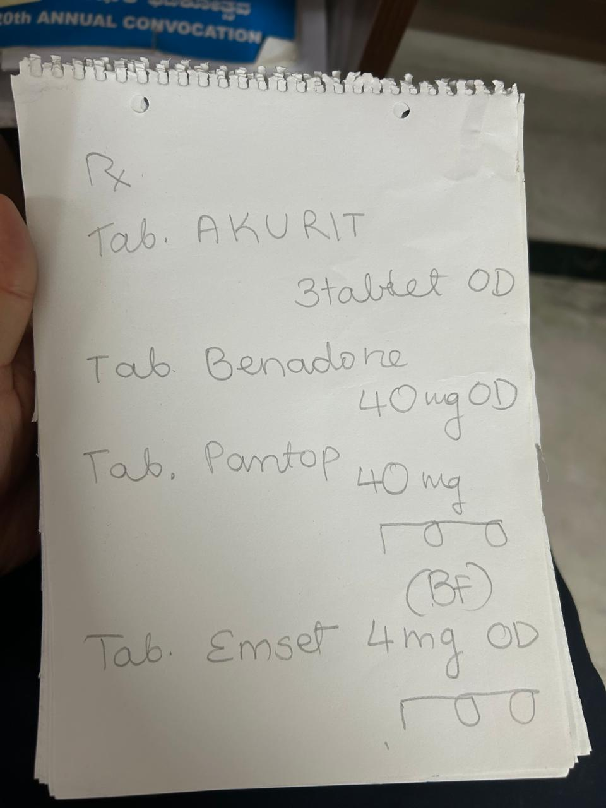

# Medical Prescription AI Audio Assistant

A tool that converts medicine prescriptions (images) into patient-friendly audio instructions in Hindi.

## The Problem

During a conversation with my sister-in-law, an ER doctor at AIIMS (All India Institute of Medical Sciences) in New Dlehi, I learned about an issue that affects patient outcomes:

> "Many of my patients take incorrect medications because they can't read the English prescriptions. They're either unfamiliar with English or medical terminology, leading to dangerous medication errors. Prescriptions are in English and they rely on the pharmacist to tell them what each medication looks like"

This is particularly problematic for elderly patients and those from regions where Hindi is the primary language. While doctors can explain verbally during consultations, patients often forget details once they get home.

## The Solution

I built a simple prescription-to-audio AI tool that:

1. Takes a photo of a prescription
2. Uses OCR to identify medicines and dosages
3. Matches detected text to a database of known medications
4. Creates natural, conversational instructions in Hindi
5. Generates an audio file that patients can listen to at home

## How It Works

### Prescription Analysis (Computer Vision)

The `prescription_analyzer.py` module:
- Uses Azure Computer Vision's OCR to extract text from prescription images
- Applies fuzzy matching against a medicines database
- Extracts dosage information using regex patterns
- Scores confidence for each medicine match
- Outputs structured JSON with medicine details

### Hindi Audio Generation

The `audio_creator.py` module:
- Takes the structured prescription data
- Uses GPT-4 to generate patient-friendly Hindi instructions
- Handles proper medicine identification with color/shape descriptions
- Creates audio using ElevenLabs' multilingual voice synthesis
- Outputs both text and MP3 files with the instructions

## Setup and Usage

### Prerequisites

```
pip install -r requirements.txt
```

### Environment Variables

For security, set these environment variables:
```
export AZURE_VISION_KEY=your_azure_key
export AZURE_VISION_ENDPOINT=your_azure_endpoint
export OPENAI_API_KEY=your_openai_key
export ELEVENLABS_API_KEY=your_elevenlabs_key
```

### Running the Tool

```
# Analyze the prescription image
python prescription_analyzer.py

# Generate Hindi audio instructions
python audio_creator.py
```

## Project Structure

- `prescription_analyzer.py` - OCR and medicine recognition
- `audio_creator.py` - Hindi instruction and audio generation
- `medicines.csv` - Database of medicine information
- `prescription_analysis.json` - Output from prescription analysis
- `patient_instructions_hindi.txt` - Generated Hindi instructions
- `patient_instructions_hindi.mp3` - Generated audio file

## Sample Output

### Input Prescription


### Output Audio Instructions
Listen to the generated Hindi instructions:

<iframe width="100%" height="166" scrolling="no" frameborder="no" src="https://w.soundcloud.com/player/?url=https%3A//api.soundcloud.com/tracks/2079307648"></iframe>


## Limitations & Future Work

This is a POC with limitations that I think can be easily resolved:
- The medicine database is limited to common Indian medications. I've seen more rigorous databases available online, which can be used for enhancements.
- OCR quality depends on image clarity and handwriting legibility, but generally works across a few samples
- Currently only supports Hindi (could extend to other languages)

Additional improvements could include:
- A mobile app for direct patient use
- Integration with hospital EMR systems
- Expanding the medicine database
- Support for multiple languages